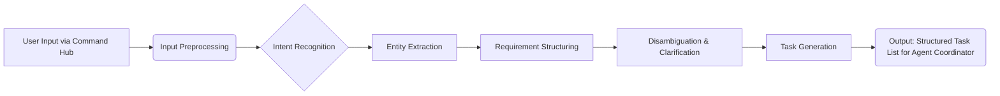

# Prompt Processing Algorithm

This document outlines the algorithm used by the ADE platform to process the initial user prompt provided via the Command Hub and translate it into structured tasks for the specialized agent system.

## Overview

The goal is to transform free-form natural language input into actionable, structured data that the Agent Coordinator can use to initiate the application creation workflow.



## Detailed Steps

### 1. Input Preprocessing
- **Action:** Clean the raw user input text.
- **Details:**
    - Normalize whitespace.
    - Correct common typos/misspellings (optional, based on model capability).
    - Handle case sensitivity (e.g., convert to lowercase).
- **Output:** Cleaned prompt text.

### 2. Intent Recognition
- **Action:** Determine the primary goal or intent of the user's request.
- **Details:**
    - Classify the request (e.g., "create application", "modify existing feature", "ask question", "deploy application").
    - Identify key verbs and action phrases.
    - Leverage NLP models (e.g., large language models) for classification.
- **Output:** Primary user intent(s).

### 3. Entity Extraction
- **Action:** Identify and extract key pieces of information (entities) from the prompt.
- **Details:**
    - Extract application type (e.g., "web app", "mobile app", "API").
    - Identify core features (e.g., "user login", "product catalog", "payment processing").
    - Extract target platform/technology stack (e.g., "React frontend", "Python backend", "PostgreSQL database").
    - Identify constraints (e.g., "must be responsive", "high performance needed", "specific security requirements").
    - Recognize non-functional requirements (e.g., scalability, maintainability).
    - Use Named Entity Recognition (NER) models and potentially rule-based extraction.
- **Output:** List of extracted entities and their types.

### 4. Requirement Structuring
- **Action:** Organize the extracted intents and entities into a structured format.
- **Details:**
    - Map entities to a predefined schema (e.g., JSON, YAML).
    - Group related features and constraints.
    - Represent requirements in a machine-readable format.
    - Example Schema Snippet:
      ```json
      {
        "intent": "create_application",
        "app_type": "web",
        "technologies": ["React", "Node.js", "MongoDB"],
        "features": [
          {"name": "user_authentication", "details": "Standard email/password login"},
          {"name": "product_search", "details": "Search by name and category"}
        ],
        "constraints": ["responsive_design", "high_availability"]
      }
      ```
- **Output:** Structured requirements object.

### 5. Disambiguation & Clarification (If Needed)
- **Action:** Identify ambiguities or missing information and potentially request clarification from the user.
- **Details:**
    - Check for conflicting requirements.
    - Identify underspecified features or constraints.
    - If critical information is missing or ambiguous:
        - Formulate specific questions for the user.
        - Present questions via the Command Hub interface.
        - Update structured requirements based on user response.
- **Output:** Validated and potentially updated structured requirements object.

### 6. Task Generation
- **Action:** Translate the structured requirements into specific, actionable tasks for the Agent Coordinator.
- **Details:**
    - Map structured requirements to initial high-level tasks for relevant agents (e.g., "Design UI for feature X", "Define architecture for Y", "Implement Z").
    - Assign initial priorities based on dependencies.
    - Format tasks according to the Agent Coordinator's expected input schema.
- **Output:** List of initial tasks for the Agent Coordinator.

## Technologies & Considerations
- **NLP/LLM:** Leveraging advanced models for intent recognition, entity extraction, and potentially clarification question generation.
- **Schema Definition:** A well-defined, extensible schema for structured requirements is crucial.
- **User Experience:** The clarification step should be intuitive and minimize user friction.
- **Iterative Refinement:** This algorithm may be invoked multiple times if the user provides further details or modifies requirements.

