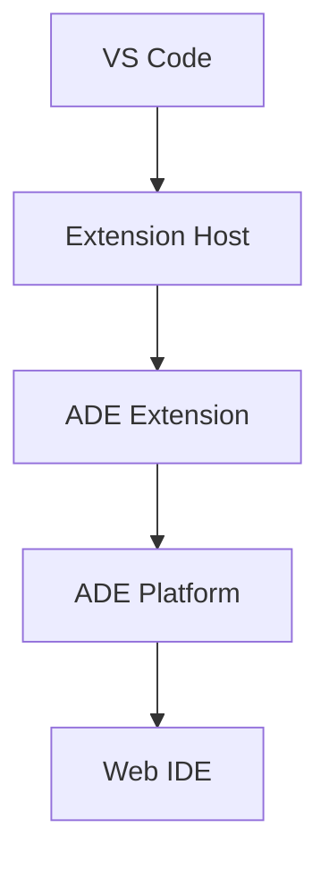

# VS Code Extension Strategy

## Overview
The ADE VS Code extension provides seamless integration between VS Code and the ADE platform while maintaining local development capabilities.

## Core Features

### 1. ADE Integration
```typescript
interface ADEIntegration {
  // Connection
  connect(): Promise<void>;
  disconnect(): Promise<void>;
  getStatus(): ConnectionStatus;

  // Sync
  syncProject(): Promise<void>;
  syncFile(path: string): Promise<void>;
  watchChanges(): void;

  // AI Features
  startAgent(type: AgentType): Promise<void>;
  stopAgent(id: string): Promise<void>;
  getAgentStatus(id: string): Promise<AgentStatus>;
}
```

### 2. UI Components

1. **Activity Bar**
- Project Explorer
- AI Agents
- Sync Status
- Settings

2. **Side Panel**
```typescript
interface SidePanel {
  // Views
  ProjectExplorer: TreeDataProvider;
  AgentView: TreeDataProvider;
  SyncView: TreeDataProvider;

  // Commands
  refresh(): void;
  focus(view: string): void;
}
```

3. **Status Bar**
- Connection status
- Sync status
- Active agents
- Quick actions

### 3. Command Integration
```typescript
interface CommandRegistry {
  // ADE Commands
  'ade.connect': () => Promise<void>;
  'ade.sync': () => Promise<void>;
  'ade.startAgent': () => Promise<void>;
  'ade.stopAgent': () => Promise<void>;
  
  // VS Code Commands
  'vscode.openFolder': () => Promise<void>;
  'vscode.executeCommand': () => Promise<void>;
}
```

## Extension Architecture

1. **Core Components**
```
extension/
├── src/
│   ├── core/           # Core functionality
│   │   ├── sync.ts
│   │   ├── agents.ts
│   │   └── connection.ts
│   ├── ui/            # UI components
│   │   ├── views/
│   │   ├── panels/
│   │   └── statusbar/
│   ├── commands/      # Command handlers
│   └── providers/     # Data providers
```

2. **Communication Flow**


## Integration Points

### 1. File System
- File watchers
- Workspace management
- Source control
- File decorations

### 2. Editor
- Custom editors
- Text document providers
- Diagnostic providers
- Code actions

### 3. Debug
- Debug adapters
- Breakpoint management
- Variable inspection
- REPL integration

### 4. Terminal
- Integrated terminal
- Task running
- Problem matchers
- Output channels

## Performance Optimizations

1. **Activation Events**
- Lazy loading
- Command deferral
- Resource management
- Cache optimization

2. **Memory Management**
- Disposable resources
- Memory limits
- Garbage collection
- Resource pooling

3. **Network Efficiency**
- Request batching
- Response caching
- Connection pooling
- Retry mechanisms

## Security Considerations

1. **Authentication**
- Token management
- Secure storage
- Session handling
- Scope control

2. **Data Protection**
- Local encryption
- Secure transport
- Access control
- Audit logging

## Future Enhancements

1. **Enhanced Integration**
- Custom views
- Webview panels
- Custom editors
- Language servers

2. **AI Features**
- Code completion
- Refactoring
- Documentation
- Testing

3. **Collaboration**
- Live share
- Code review
- Chat
- Presence
