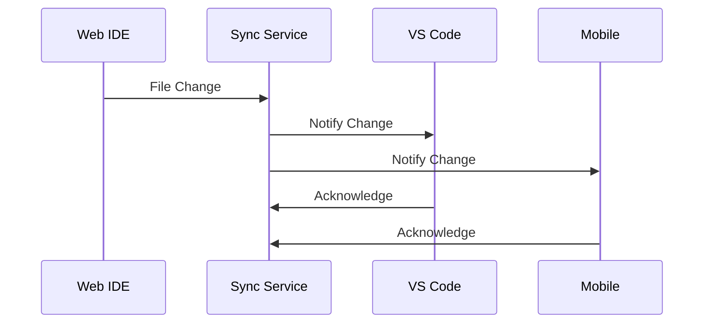
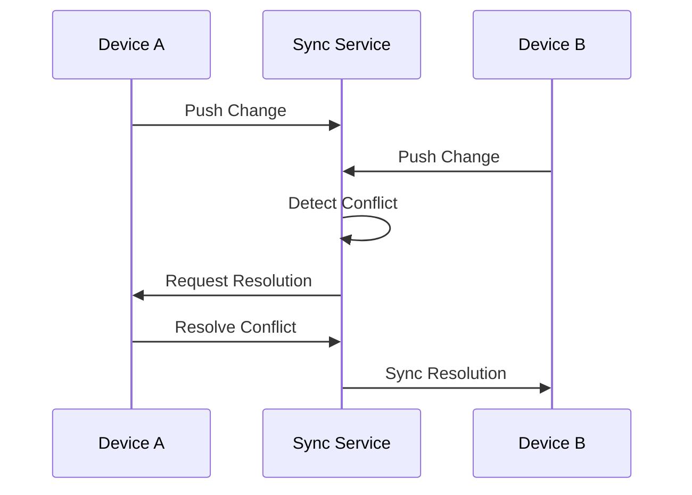

# ADE Sync Strategy

## Overview
ADE implements a multi-platform sync strategy to ensure seamless development across web, desktop, and mobile platforms.

## Core Components

### 1. Sync Service
```typescript
interface SyncService {
  // File Operations
  syncFile(path: string, content: string, timestamp: number): Promise<void>;
  getFileStatus(path: string): Promise<FileStatus>;
  resolveConflict(path: string, resolution: string): Promise<void>;

  // Project Operations
  syncProject(projectId: string): Promise<void>;
  getProjectStatus(projectId: string): Promise<ProjectStatus>;

  // Device Management
  registerDevice(deviceId: string, platform: 'web' | 'desktop' | 'mobile'): Promise<void>;
  getConnectedDevices(): Promise<Device[]>;
}
```

### 2. File System Abstraction
```typescript
interface FileSystem {
  // Local Operations
  read(path: string): Promise<string>;
  write(path: string, content: string): Promise<void>;
  watch(pattern: string, callback: (event: FileEvent) => void): void;
  
  // Remote Operations
  pull(path: string): Promise<void>;
  push(path: string): Promise<void>;
  
  // Status
  getStatus(path: string): Promise<FileStatus>;
}
```

### 3. Conflict Resolution
```typescript
interface ConflictResolver {
  detect(local: FileVersion, remote: FileVersion): boolean;
  resolve(local: FileVersion, remote: FileVersion): Promise<Resolution>;
  applyResolution(path: string, resolution: Resolution): Promise<void>;
}
```

## Sync Flow

1. **Real-time Sync**


2. **Conflict Resolution**


## Implementation Strategy

### 1. Web IDE (Primary Platform)
- Real-time collaboration
- Cloud storage integration
- Automatic sync
- Conflict resolution UI

### 2. VS Code Extension
- File system watcher
- Background sync
- Status indicators
- Command palette integration

### 3. Mobile Support
- Read-only by default
- Selective sync
- Offline support
- Push notifications

## Performance Considerations

1. **Bandwidth Optimization**
- Differential sync
- Compression
- Chunk-based transfers
- Binary file handling

2. **Storage Strategy**
- Local caching
- Selective sync
- Garbage collection
- Version history

3. **Conflict Prevention**
- File locking
- Operation queuing
- Transaction support
- Merge strategies

## Security

1. **Data Protection**
- End-to-end encryption
- Secure transport
- Access control
- Audit logging

2. **Authentication**
- OAuth 2.0
- Device registration
- Token management
- Session control

## Future Extensions

1. **Enhanced Collaboration**
- Live share
- Code review
- Chat integration
- Presence awareness

2. **AI Integration**
- Smart conflict resolution
- Code suggestions
- Pattern recognition
- Automated fixes
