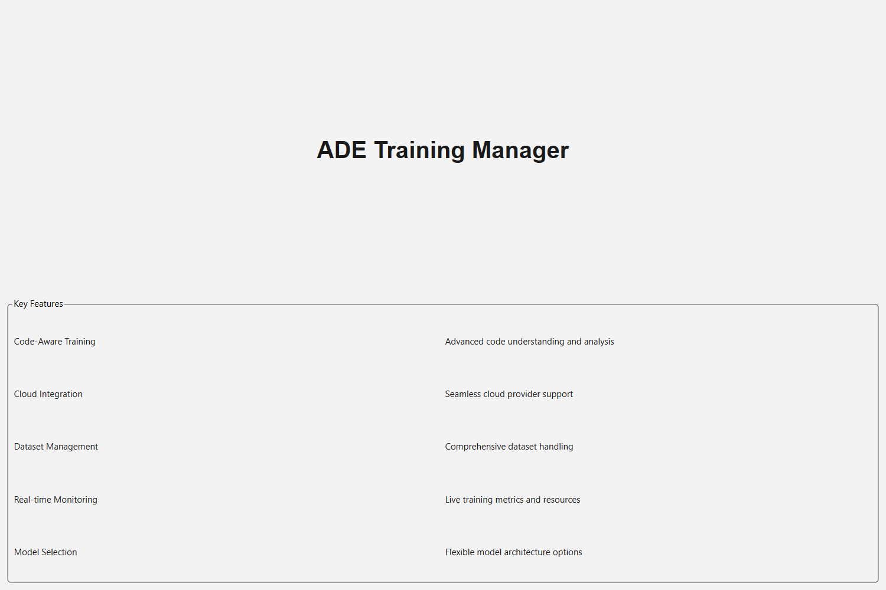
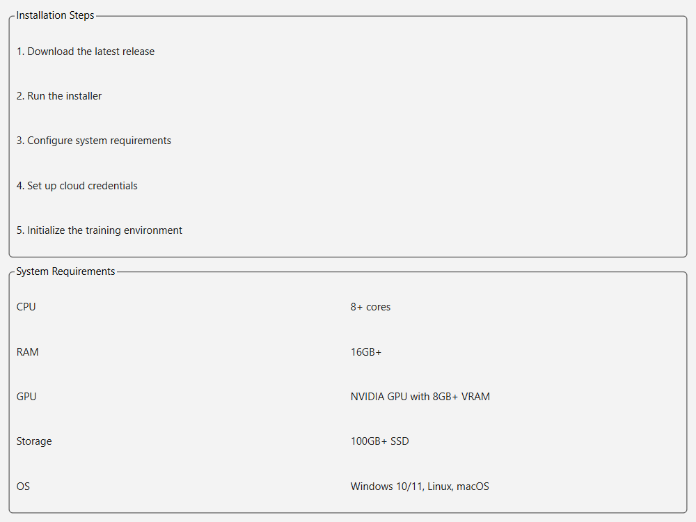
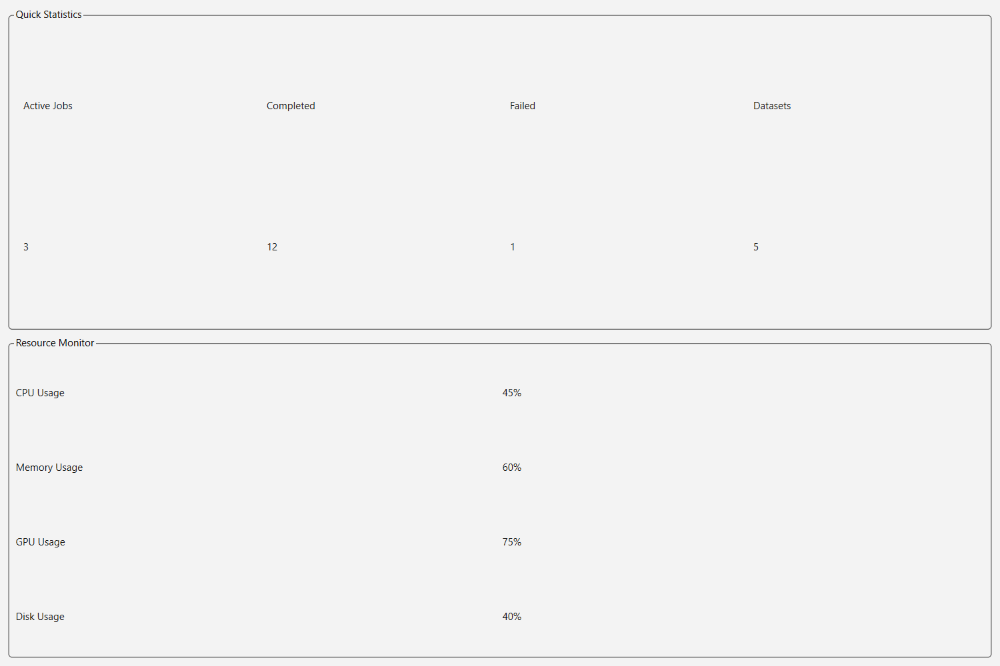
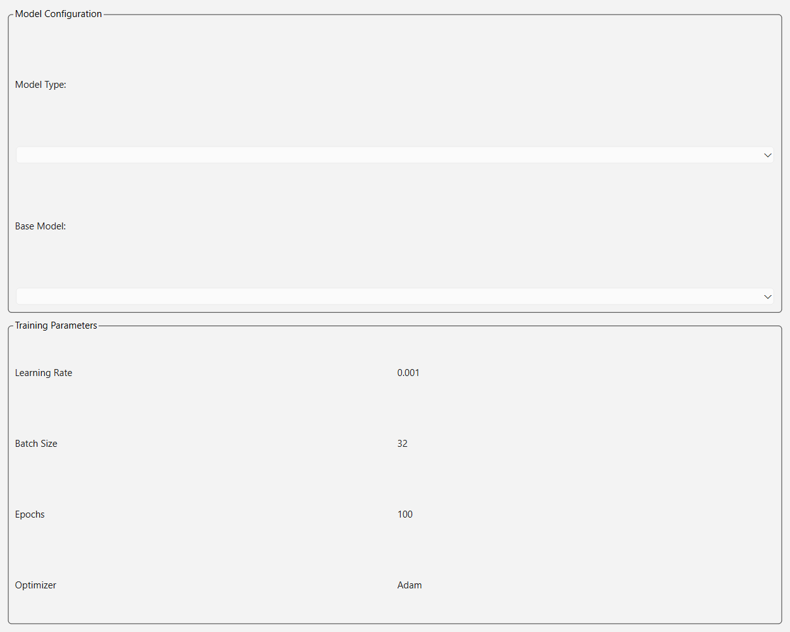
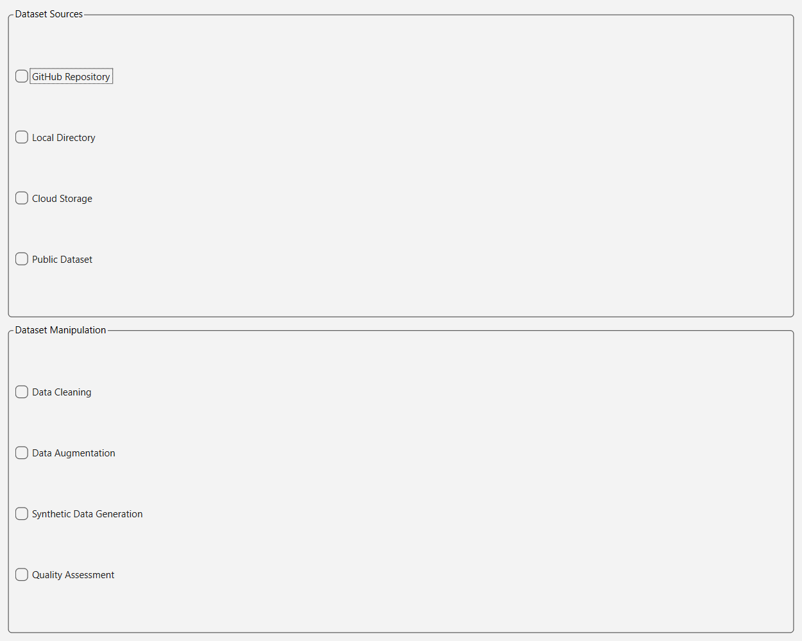
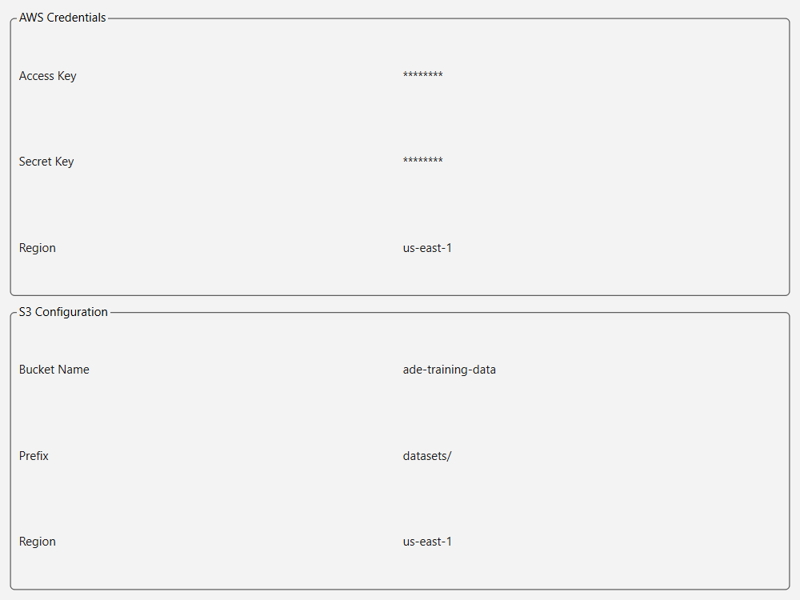
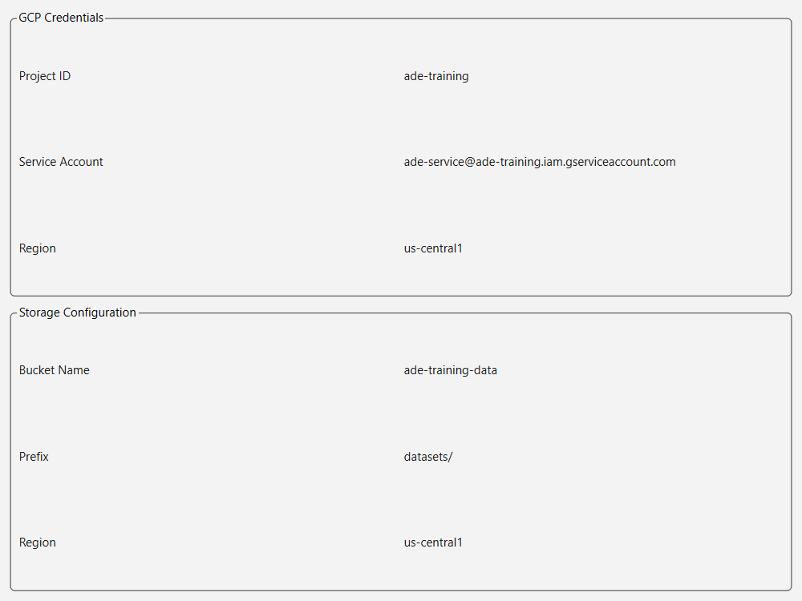
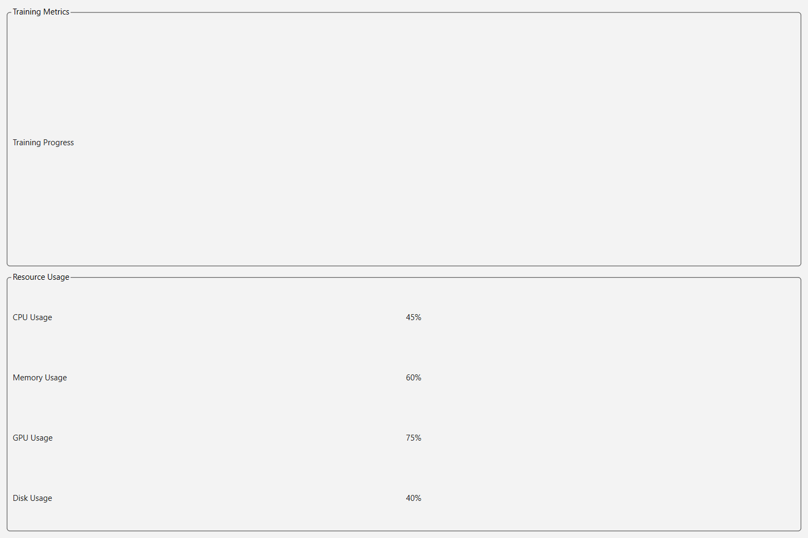

# ADE Training Manager Tutorial

## Table of Contents
1. [Introduction](#introduction)
2. [Installation and Setup](#installation-and-setup)
3. [Interface Overview](#interface-overview)
4. [Dashboard](#dashboard)
5. [Training Management](#training-management)
6. [Dataset Management](#dataset-management)
7. [Cloud Integration](#cloud-integration)
8. [Monitoring and Analytics](#monitoring-and-analytics)
9. [Advanced Features](#advanced-features)
10. [Troubleshooting](#troubleshooting)

## Introduction
The ADE Training Manager is a comprehensive tool for training and managing AI models specifically designed for code awareness, planning, execution, and code generation capabilities. This tutorial will guide you through the process of using the ADE Training Manager effectively.



## Installation and Setup

### System Requirements
- Windows 10/11
- Python 3.8+
- CUDA-capable GPU (recommended)
- Minimum 16GB RAM
- 100GB free disk space

### Installation Steps
1. Navigate to the installation directory (D:\ade-platform)
2. Run `modeltrainingmanager.exe`
3. The application will start and minimize to the system tray
4. Click the tray icon to open the main interface



## Interface Overview

### Main Components
1. **Sidebar Navigation**
   - Dashboard
   - Training
   - Datasets
   - Cloud Providers
   - Monitoring
   - Settings


2. **System Tray Integration**
   - Quick access to main functions
   - Status notifications
   - Background monitoring

## Dashboard

### Overview Panel
The dashboard provides a comprehensive overview of your training environment:

1. **Model Capabilities**
   - Code Awareness
   - Planning
   - Execution
   - Code Generation

2. **Quick Stats**
   - Active Training Jobs
   - Completed Jobs
   - Failed Jobs
   - Total Datasets
   - Model Version

3. **Resource Monitor**
   - CPU Usage
   - Memory Usage
   - GPU Usage
   - Network Activity

4. **Recent Activity**
   - Training Events
   - System Updates
   - Error Logs



## Training Management

### Model Configuration
1. **Model Selection**
   - Choose model type (Transformer, CNN, RNN)
   - Select base model
   - Configure architecture

2. **Hyperparameters**
   - Learning Rate: 2e-5
   - Batch Size: 8
   - Epochs: 3
   - Warmup Steps: 1000

3. **Training Options**
   - Mixed Precision Training
   - Gradient Accumulation
   - Early Stopping



### Training Controls
1. **Start Training**
   - Click "Start Training"
   - Monitor progress
   - View metrics

2. **Pause/Resume**
   - Pause training
   - Save checkpoint
   - Resume from checkpoint

3. **Stop Training**
   - Graceful shutdown
   - Save final model
   - Export results

## Dataset Management

### Dataset Creation
1. **Source Selection**
   - GitHub Repositories
   - Local Codebase
   - Public Datasets
   - Custom Sources

2. **Preprocessing**
   - Tokenization
   - Code Cleaning
   - Data Augmentation

3. **Quality Control**
   - Validation
   - Testing
   - Version Control



### GitHub Integration
1. **Repository Selection**
   - Enter repository URL
   - Select branch
   - Choose file patterns

2. **Data Extraction**
   - Clone repository
   - Filter files
   - Process code

3. **Dataset Generation**
   - Parse code
   - Extract features
   - Create training set

## Cloud Integration

### AWS SageMaker Setup
1. **Credentials Configuration**
   ```json
   {
     "access_key": "YOUR_ACCESS_KEY",
     "secret_key": "YOUR_SECRET_KEY",
     "region": "us-east-1",
     "bucket": "your-bucket-name",
     "prefix": "training-data/"
   }
   ```

2. **Instance Configuration**
   - Select instance type
   - Configure storage
   - Set up networking

3. **Training Job Setup**
   - Define job name
   - Set hyperparameters
   - Configure monitoring



### Google Cloud Setup
1. **Project Configuration**
   ```json
   {
     "project_id": "your-project-id",
     "service_account": "path/to/service-account.json",
     "region": "us-central1"
   }
   ```

2. **Vertex AI Setup**
   - Create workspace
   - Configure compute
   - Set up storage

3. **Training Configuration**
   - Define experiment
   - Set parameters
   - Configure monitoring



## Monitoring and Analytics

### Real-time Monitoring
1. **Resource Usage**
   - CPU utilization
   - Memory consumption
   - GPU usage
   - Network traffic

2. **Training Metrics**
   - Loss curves
   - Accuracy metrics
   - Learning rate
   - Gradient norms

3. **System Health**
   - Temperature
   - Power usage
   - Storage space



### Analytics
1. **Performance Analysis**
   - Training speed
   - Resource efficiency
   - Cost analysis

2. **Quality Metrics**
   - Model accuracy
   - Code quality
   - Error rates

3. **Trend Analysis**
   - Historical data
   - Performance trends
   - Improvement areas

## Advanced Features

### Code-Aware Training
1. **AST Analysis**
   - Parse code structure
   - Extract patterns
   - Generate features

2. **Semantic Analysis**
   - Variable tracking
   - Function calls
   - Control flow

3. **Quality Metrics**
   - Complexity analysis
   - Code coverage
   - Style checking

### Custom Training Rules
1. **Rule Definition**
   - Syntax rules
   - Style guidelines
   - Best practices

2. **Validation**
   - Rule checking
   - Compliance testing
   - Quality assurance

3. **Enforcement**
   - Automatic fixes
   - Warning system
   - Error prevention

## Troubleshooting

### Common Issues
1. **Resource Problems**
   - Out of memory
   - GPU errors
   - Storage issues

2. **Training Issues**
   - Convergence problems
   - Gradient issues
   - Performance bottlenecks

3. **Integration Issues**
   - Cloud connection
   - API errors
   - Authentication problems

### Solutions
1. **Resource Management**
   - Adjust batch size
   - Optimize memory
   - Scale resources

2. **Training Optimization**
   - Tune hyperparameters
   - Adjust learning rate
   - Modify architecture

3. **Integration Fixes**
   - Verify credentials
   - Check connectivity
   - Update configurations

## Best Practices

### Training
1. Start with small datasets
2. Use validation sets
3. Monitor early metrics
4. Save checkpoints regularly

### Resource Management
1. Monitor system resources
2. Use appropriate instance types
3. Optimize storage usage
4. Implement cost controls

### Code Quality
1. Follow coding standards
2. Implement testing
3. Document changes
4. Version control

## Support and Resources

### Documentation
- [API Reference](docs/api.md)
- [Configuration Guide](docs/config.md)
- [Troubleshooting Guide](docs/troubleshooting.md)

### Community
- [GitHub Repository](https://github.com/your-repo)
- [Discussion Forum](https://forum.your-site.com)
- [Stack Overflow](https://stackoverflow.com/questions/tagged/ade)

### Updates
- Check for updates regularly
- Review release notes
- Test new features
- Backup configurations 